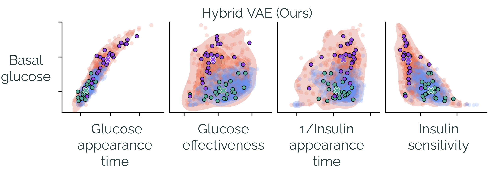
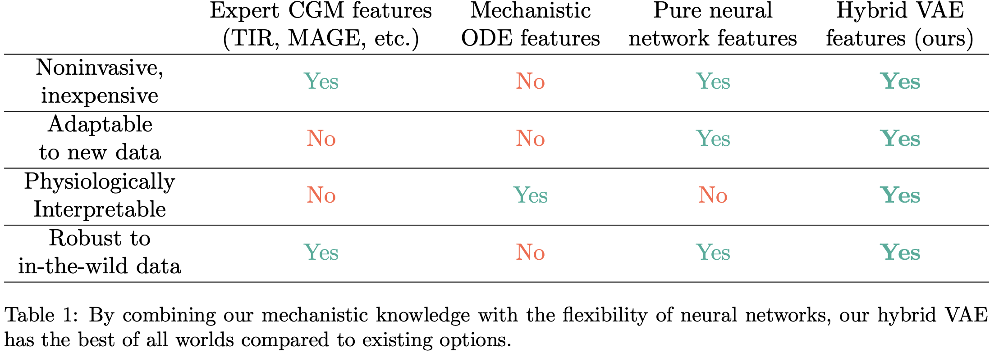
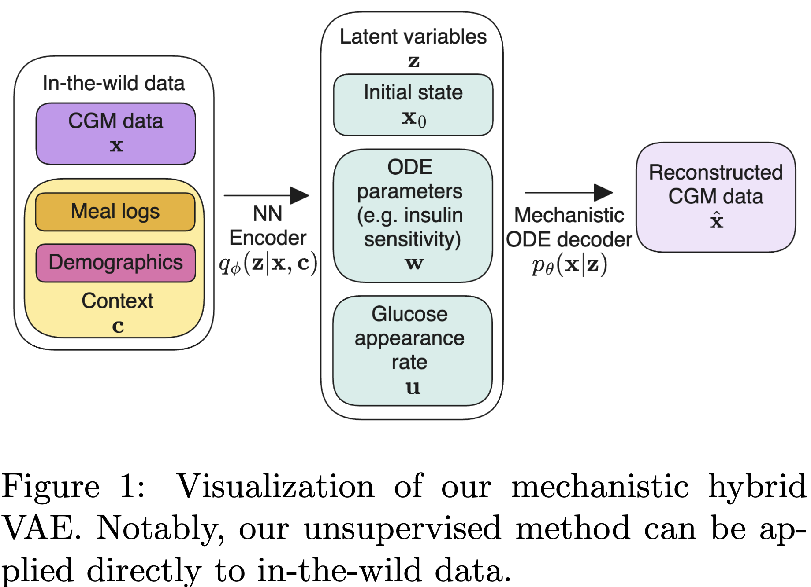

# Hybrid VAE for interpretable type-2 diabetes subtyping in-the-wild



> **Interpretable Mechanistic Representations for Glycemic Control**\
> Ke Alexander Wang, Emily B. Fox \
> Published at *Machine Learning for Healthcare (ML4H), 2023*\
> Paper: [https://arxiv.org/abs/2312.03344](https://arxiv.org/abs/2312.03344)

## About

Our Hybrid VAE is a new machine learning model that can embed post-meal glucose responses in an interpretable space, using a combination of unsupervised learning and hybrid modeling.

### For clinicians and biomedical engineers
Our model for the first time allows us to characterize Type-2 diabetes heterogeneity through various traditional metrics (glucose appearance time, glucose effectiveness, insulin sensitivity, etc.), as defined by *Bergman's minimal model*, using **only CGM and meal log data and no diagnosis information**. Each point in our embedding space represents a meal eaten by an individual. In the figure above, red represents T2D and blue represents pre-diabetes.

We do the above using in-the-wild data; up until now this would have needed an oral glucose tolerance test (OGTT) and glucose modeling expertise for each **meal and individual**.



### For machine learning researchers
Our model is an autoregressive variational autoencoder with a mechanistic differential equation decoder.
Our mechanistic decoder uses our longstanding prior knowledge about glucose dynamics, based on Bergman's minimal model. By constraining the latent space to the ODE parameter space, we get both interpretability **and** improved performance.



## Citation

If you use this codebase, or otherwise found our work valuable, please cite Mamba:
```
@article{hybridvae,
  title={Interpretable Mechanistic Representations for Glycemic Control},
  author={Wang, Ke Alexander and Fox, Emily B.},
  journal={Machine Learning for Healthcare},
  year={2023}
}
```